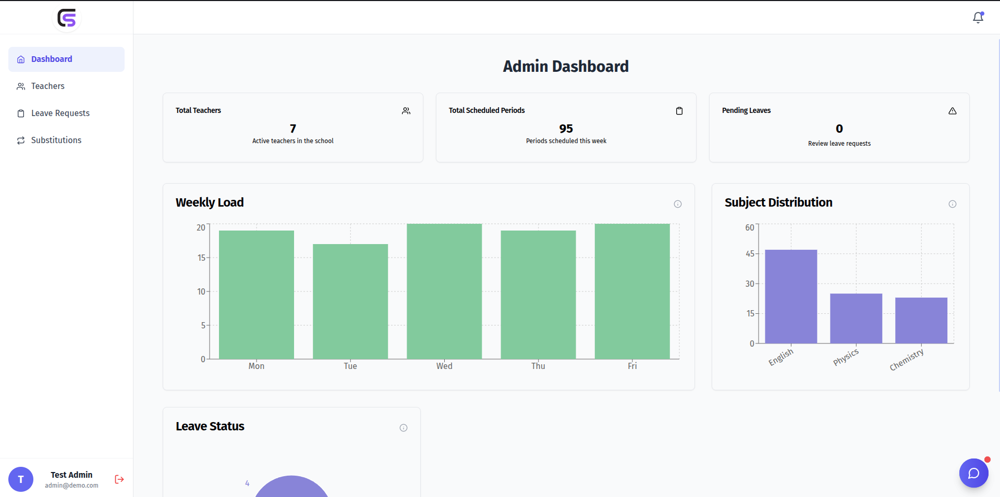
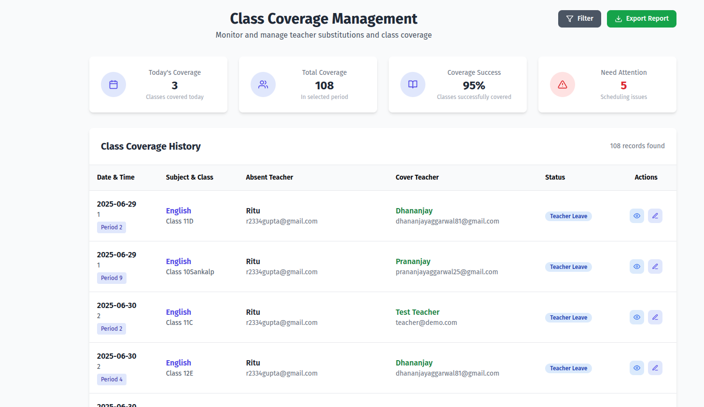

# ClassSync

> **A Modern School Management Platform for Effortless Scheduling, Leave, and Substitution Management**

<p align="center">
  
</p>

---

## 🌟 Core Idea & Vision
ClassSync is designed to revolutionize how schools manage teacher schedules, leave applications, and substitution assignments. By automating tedious processes and providing real-time insights, ClassSync empowers administrators and teachers to focus on what matters most—education.

---

## ❓ The Problem
Traditional school scheduling and substitution management are manual, error-prone, and time-consuming. Administrators struggle with:
- Last-minute teacher absences
- Manual substitution assignments
- Inefficient leave tracking
- Lack of real-time visibility into schedules and resource allocation
- Scheduling conflicts where a teacher is assigned to their own class and as a substitute in another class at the same time, leading to operational confusion

---

## 🚀 Impact
- **Reduced manual scheduling workload by 40%** through automated substitution assignment
- **Improved administrative response time by 30%** with real-time dashboards and streamlined workflows
- **Enhanced transparency** for teachers and admins with role-based access and clear data visualization

---

## ✨ Key Features
- **Role-Based Dashboards:** Separate, intuitive interfaces for Admins and Teachers
- **Secure Authentication:** JWT-based login and role management
- **Automated Substitution Assignment:** Quickly fill teacher absences with minimal manual effort
- **Leave Management:** Apply for, approve, and track leave requests
- **Schedule Management:** View, edit, and manage class and teacher schedules
- **Real-Time Analytics:** Interactive charts and dashboards for actionable insights
- **Modern UI:** Built with React and Tailwind CSS for a seamless user experience
- **Chatbot Assistant:** In-app help and guidance (optional)

---

## 🏗️ Project Structure & Architecture
ClassSync is a monorepo with clear separation between frontend and backend:

```
ClassSync/
├── backend/    # Node.js, Express, MongoDB REST API
├── frontend/   # React, Vite, Tailwind CSS SPA
└── README.md   # (You are here)
```
- **Frontend:** Modern SPA with role-based routing, dashboards, and real-time charts
- **Backend:** Secure REST API with authentication, scheduling, leave, and substitution logic

---

## ⚡ Quick Start
1. **Clone the repository:**
   ```bash
   git clone https://github.com/dhananjay6561/ClassSync
   ```
2. **Follow setup instructions in** [`backend/README.md`](./backend/README.md) **and** [`frontend/README.md`](./frontend/README.md)

---

## 🖼️ Screenshots

| Dashboard Example | Leave Management | Substitution Assignment |
|-------------------|------------------|------------------------|
| |  |  |

---

## 🤝 Contributing
Pull requests are welcome! For major changes, please open an issue first to discuss what you would like to change.

---

## 📬 Contact
For questions or support, please contact me at dhananjayaggarwal6561@gmail.com 

---

## 🛠️ How to Contribute
We welcome contributions from the community! To contribute:

1. **Fork the repository** on GitHub.
2. **Clone your fork** locally:
   ```bash
   git clone https://github.com/dhananjay6561/ClassSync
   ```
3. **Create a new branch** for your feature or bugfix:
   ```bash
   git checkout -b feature/your-feature-name
   ```
4. **Make your changes** and commit them with clear messages.
5. **Push your branch** to your forked repo:
   ```bash
   git push origin feature/your-feature-name
   ```
6. **Open a Pull Request** on GitHub, describing your changes and referencing any related issues.

**Tips:**
- Please follow the existing code style and structure.
- For major changes, open an issue first to discuss your ideas.
- All contributions will be reviewed before merging.

Thank you for helping improve ClassSync! 